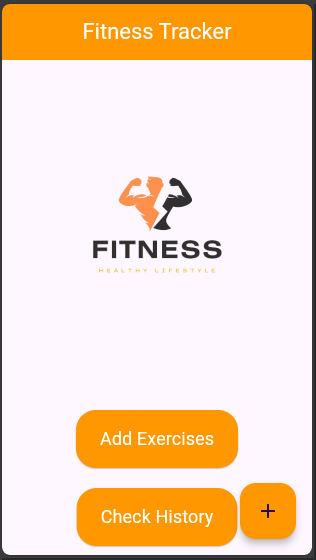
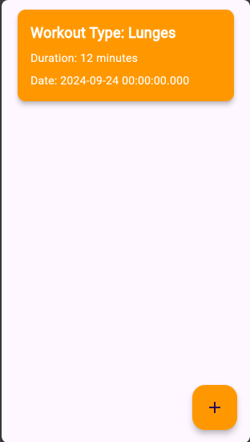

# Fitness Tracker App 🏋️‍♂️📱


## Table of Contents

- [Fitness Tracker App 🏋️‍♂️📱](#fitness-tracker-app-️️)
  - [Table of Contents](#table-of-contents)
  - [Description](#description)
  - [Technologies Used 🚀](#technologies-used-)
  - [Features 🌟](#features-)
  - [App UI Screenshots 📸](#app-ui-screenshots-)
  - [Getting Started 🚀](#getting-started-)
  - [Feedback](#feedback)
  - [License](#license)

## Description

The **Fitness Tracker App** is your ultimate companion for monitoring workouts and tracking fitness progress. This mobile application features an intuitive interface that allows users to **add**, **view**, and **manage** workout sessions seamlessly. Whether you're a fitness enthusiast or just starting your journey, this app is designed to keep you organized and motivated every step of the way!

## Technologies Used 🚀

- **Flutter:** A powerful UI toolkit for crafting natively compiled applications for mobile, web, and desktop from a single codebase.
- **Dart:** An optimized programming language for building high-performance mobile, desktop, server, and web applications.
- **Provider Package:** A state management solution that makes it easy to manage app state in Flutter applications.
- **Sqflite:** A Flutter plugin for SQLite, ensuring a high-performance and persistent relational database for data storage.

## Features 🌟

1. **Add Workouts:** Effortlessly log new workout sessions, specifying details such as type, date, and duration.
2. **View Workout History:** Access a comprehensive history screen displaying all saved workouts, enabling users to track their fitness journey.
3. **Detailed Workout Information:** Each entry provides essential details, including workout type, duration, and date for thorough tracking.
4. **Responsive Design:** The app boasts a responsive design that adapts to various screen sizes, ensuring a seamless user experience across devices.
5. **Data Persistence:** Utilizing Sqflite, the app securely stores workout data locally, preserving user data between sessions.

## App UI Screenshots 📸

Here are some screenshots showcasing the app's features:

| Screen Name            | Screenshot                                            |
| ---------------------- | ----------------------------------------------------- |
| Home Screen            |                        |
| Add Exercise Screen    |        |
| History Screen         |                  |
| Category to Add Screen |  |

## Getting Started 🚀

Follow these simple steps to set up the Fitness Tracker App on your local machine:

1. **Clone the Repository:**

   ```bash
   git clone https://github.com/samkiyya/CodeAlpha_AppDev_Intern.git
   ```

2. **Navigate to Project Directory:**

   ```bash
   cd CodeAlpha_AppDev_Intern/flutter_fitness_tracking_app
   ```

3. **Install Dependencies:**

   ```bash
   flutter pub get
   ```

4. **Run the App:**

   ```bash
   flutter run
   ```

## Feedback

We value your feedback and suggestions! Feel free to reach out with your thoughts to help us improve the app.

## License

This app is licensed under the **MIT License**, allowing you the freedom to use, modify, and distribute the code.

---

Happy coding! 🚀
