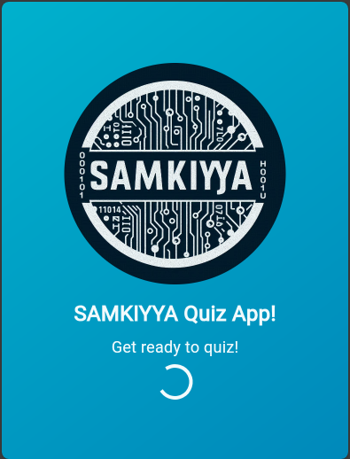
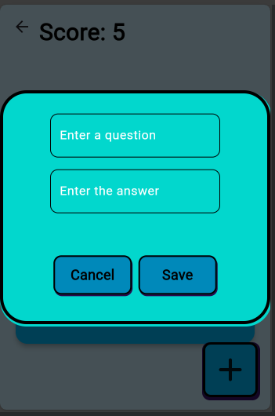
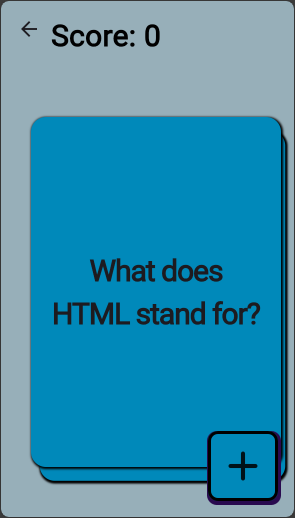
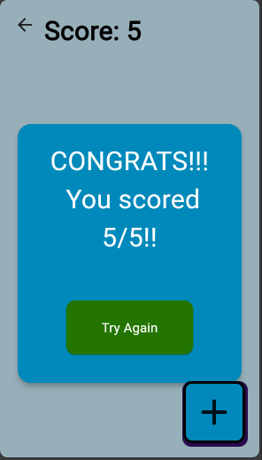
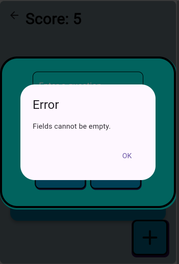

# **SamKiyya FlashCard Quiz App** 🎓🧠

Welcome to **SamKiyya**, a Flutter-powered Flashcard Quiz app that helps users enhance their knowledge and memory retention through fun, interactive quizzes. Whether you want to test your knowledge, challenge yourself, or create your own set of questions, SamKiyya is designed to make learning enjoyable and efficient!

---

## 🌟 **Overview**

**SamKiyya** is an engaging flashcard-based quiz app aimed at users of all levels. The app provides a smooth user experience with swipeable flashcards, intuitive navigation, and features that allow for customization. With scoring and shuffling options, it motivates users to constantly improve and adapt to new challenges, making it ideal for learners of all ages.

---

## 🎯 **Key Features** ✨

- **Swipeable Flashcards**: Effortlessly swipe through questions and answers, making learning feel more interactive and engaging.

- **Score Tracking**: A built-in scoring system allows users to track their progress and strive for continuous improvement.

- **Shuffle Functionality**: Randomize the order of flashcards for a more dynamic and challenging quiz experience.

- **Custom Questions**: Add your own custom flashcards and questions, personalizing the quiz experience to suit your learning needs.

- **User-Friendly Interface**: Designed for simplicity and ease of use, making it accessible for all kinds of users.

---

## **Technologies & Packages Used** 🛠️

- **Flutter**: The app is built with Flutter, Google's UI toolkit that enables cross-platform development with a single codebase.
- **Hive**: A fast, lightweight NoSQL database for Flutter, perfect for local storage of user data like quiz scores and custom flashcards.

- **Swipeable Stack**: A package that makes it easy to implement interactive, swipeable card stacks in the app.

---

## **App Screenshots** 📸

Here are some screenshots showcasing the features of the Samkiyya Quiz app:

| Screen Name              | Screenshot                                  |
| ------------------------ | ------------------------------------------- |
| Splash Screen            |          |
| Welcome Screen           |        |
| Add Quiz Screen          |      |
| Flashcard Screen         |    |
| Score Screen             |            |
| Try to Save error Screen |  |

## Feel free to explore each feature and enjoy your quiz experience!

## **Getting Started** 🚀

### **Prerequisites**

Make sure you have Flutter installed on your machine. If you haven't already set up Flutter, follow the official guide [here](https://flutter.dev/docs/get-started/install).

### **Installation**

1. **Clone the repository**:
   ```bash
   git clone https://github.com/samkiyya/CodeAlpha_AppDev_Intern.git
   ```
2. **Navigate to the project directory**:

   ```bash
   cd CodeAlpha_AppDev_Intern/flutter_flashcard_quiz_app
   ```

3. **Install dependencies**:

   ```bash
   flutter pub get
   ```

4. **Run the app**:
   ```bash
   flutter run
   ```

That's it! The app will now start running on your connected device or simulator.

---

## 💬 **Feedback & Contributions** 🙌

We’re constantly working on improving the app, and we'd love to hear your suggestions! Feel free to contribute by submitting issues or pull requests.

- If you have any feedback or suggestions, contact me at **samuelabera523@gmail.com**.

---

## **License** 📄

This project is licensed under the **MIT License**, which means you are free to use, modify, and distribute the code for personal or commercial projects.

---

## **Resources to Help You Get Started with Flutter** 📚

If you're new to Flutter, here are some useful resources:

- [Lab: Write Your First Flutter App](https://docs.flutter.dev/get-started/codelab)
- [Cookbook: Useful Flutter Samples](https://docs.flutter.dev/cookbook)

For in-depth documentation on Flutter development, check out the [Flutter official documentation](https://docs.flutter.dev/).

---

### **Happy Coding!** 🎉🚀
