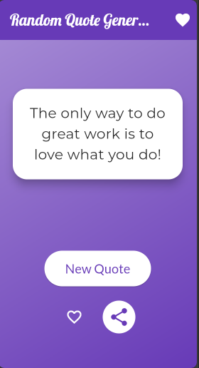
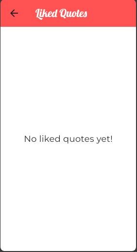
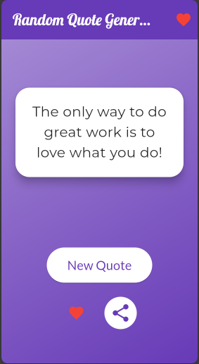
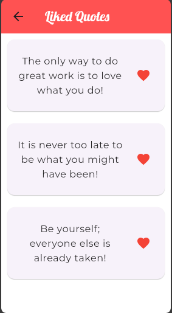

# Random Quote Generator App 📜🤔

A beautiful and simple **Flutter** project to bring daily inspiration to your fingertips.

## 🌟 Overview

The **Random Quote Generator** app is a Flutter-based mobile application designed to inspire and motivate users with random thought-provoking quotes. With a single tap, users can access a collection of quotes that offer daily wisdom and positivity. The app also includes features for easy social sharing, allowing users to spread the inspiration across various social media platforms.

## 🎯 Key Features

- **Generate Inspiring Quotes:** Tap a button to instantly receive a new random quote to boost your day with motivation and wisdom.
- **Like Quotes:** You can save your favorite quotes and view them anytime later.
- **Social Media Sharing:** Seamlessly share your favorite quotes on platforms such as Facebook, Instagram, WhatsApp, and LinkedIn to inspire others.
- **Intuitive UI:** The app features a minimalist, user-friendly design for smooth navigation and a visually delightful user experience.
- **Background Color Transitions:** Enjoy dynamic background color changes with every new quote to keep the experience fresh.
- **Persistent Storage:** The app saves liked quotes using shared preferences, ensuring they are available even after the app is closed and reopened.
- **Lightweight & Fast:** Built with Flutter, ensuring fast performance and smooth functionality across both Android and iOS devices.

## 📸 Screenshots

<div style="display: flex; flex-wrap: wrap; justify-content: center;">

  <div style="flex: 1; min-width: 300px; margin: 10px;">
    <strong>Random Quote Screen</strong>  
    
  </div>

  <div style="flex: 1; min-width: 300px; margin: 10px;">
    <strong>No Liked Quotes Screen</strong>  
    
  </div>

  <div style="flex: 1; min-width: 300px; margin: 10px;">
    <strong>Liked Random Quote Screen</strong>  
    
  </div>

  <div style="flex: 1; min-width: 300px; margin: 10px;">
    <strong>Liked Saved Quotes Screen</strong>  
    
  </div>

</div>

## 🚀 Getting Started

### Prerequisites

Before you begin, make sure you have Flutter installed on your machine. You can find installation instructions in the [official Flutter documentation](https://flutter.dev/docs/get-started/install).

### Installation Instructions

Follow these simple steps to set up the project on your local machine:

1. **Clone the repository:**

   ```bash
   git clone https://github.com/samkiyya/CodeAlpha_AppDev_Intern.git
   ```

2. **Navigate to the project directory:**

   ```bash
   cd CodeAlpha_AppDev_Intern/flutter_rand_qoute_gen
   ```

3. **Install dependencies:**

   Run the following command to install the necessary packages:

   ```bash
   flutter pub get
   ```

4. **Run the App:**

   Finally, to launch the app on your device/emulator, run:

   ```bash
   flutter run
   ```

### 📂 Modular File Structure

The project now follows a modular structure for better management and scalability. Here’s an overview:

```
assets/
│
├── quotes.json               # JSON file that stores the quote to rendomly generate
│
lib/
│
├── random_quote_screen.dart   # Handles the main random quote generation
├── saved_quotes_screen.dart   # Displays liked quotes
└── main.dart                  # Main entry point of the app
```

### 📄 Key Files

- `random_quote_screen.dart`: Handles the generation and display of random quotes with dynamic background transitions.
- `saved_quotes_screen.dart`: Displays the list of liked quotes and allows users to unlike quotes.

## 🔧 Technologies and Tools

- **Flutter**: The powerful UI toolkit for building natively compiled applications for mobile, web, and desktop from a single codebase.
- **Dart**: The programming language behind Flutter.
- **Share Plugin**: To enable social media sharing directly from the app.
- **Shared Preferences**: For storing liked quotes locally.

## 💬 Feedback & Contribution

If you have any feedback or suggestions, feel free to reach out. We welcome contributions that enhance the app's features or design. To contribute:

1. Fork the repository.
2. Create a new branch for your feature.
3. Submit a pull request with a detailed explanation of the changes.

## 📄 License

This project is licensed under the **MIT License**, meaning you're free to use, modify, and distribute the code.

## 🙌 Acknowledgements

Special thanks to the open-source community and Flutter developers for inspiring the development of this app.

---

Happy coding! 🎉🚀 Let's inspire the world, one quote at a time!
